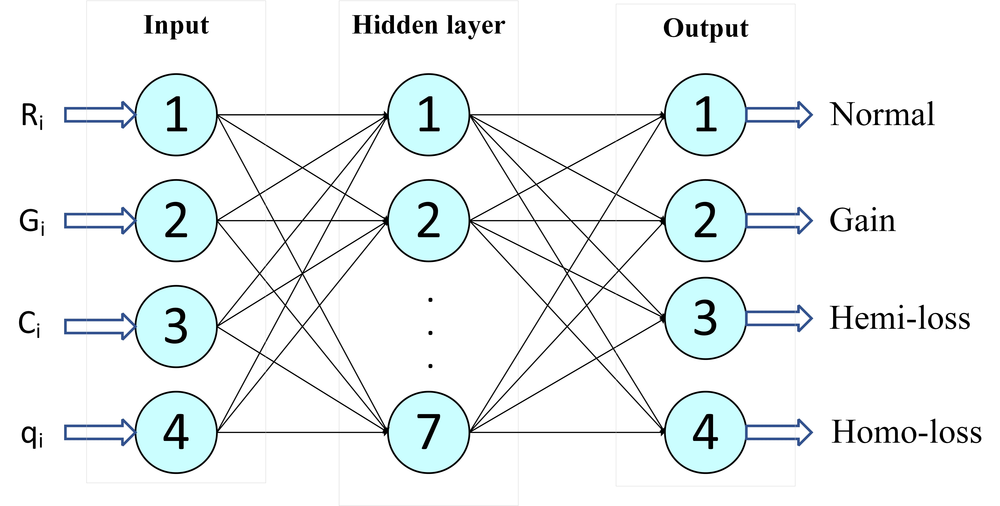
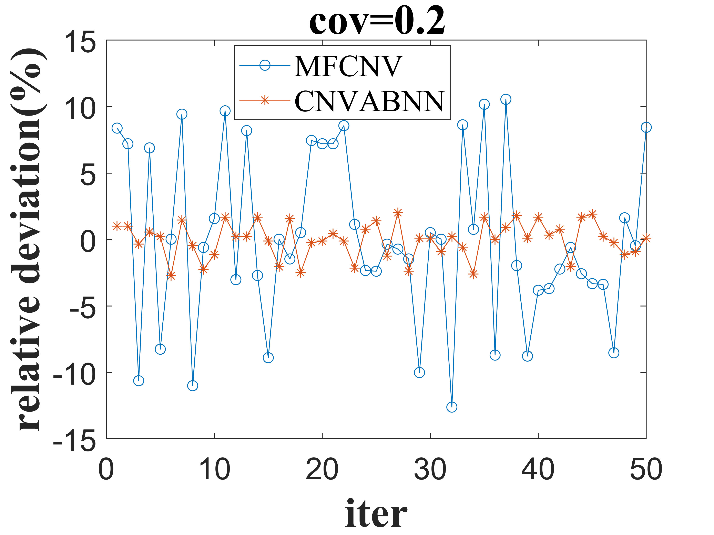

# CNVABNN
A method for CNV detection using neural networks and the AdaBoost framework

# Table of Contents
1. Introduction
2. Requirement/environment
3. Usage of CNVABNN
4. Detection performance of CNVABNN

# Document Description
code: Saved the complete code of the project
img: Saved two example images of the project
RealData: Three real datasets used by the project are saved
SimulationData(purity==0.2): The simulation dataset used in the project at a purity of 0.2 is saved
train: The training set used to train the model is saved
Ada_test_real.m: Script for testing real datasets with CNVABNN
Ada_test_sim.m: Script for testing simulated datasets with CNVABNN
combine_BP.m: Combining functions of weak classifiers
train.m: Script for training the network model of CNABNN

## introduction
CNVABNN is a cnv detection method based on RD strategy for single sample. The project provides the complete implementation code and a partial dataset. In the test dataset, there are two parts of samples, one part is simulated sample and the other part is real sample. Specific details of the usage can be found in the usage section of CNVABNN. This project combines neural network technology and AdaBoost algorithm to provide detection efficiency.

## Requirement/environment
This code was tested with Matlab R2020b and the machine configuration used for testing was as follows：
<br>
system: windows
<br>
CPU：Intel(R) Core(TM) i7-9700K CPU @ 3.60GHz 
<br>
Before running CNVABNN, BAM file needs to be preprocessed, and the corresponding code can be found in ‘code/main_simulation1.py’

## Usage of CNVABNN
The use of CNVABNN is divided into 4 main steps, which are modifying the path, training the model, testing the simulated data, and testing the real data, as detailed below.

### step0: Cloning the git repository
CNVABNN can be cloned locally with git, which is available for free from https://git-scm.com/. Once you have successfully installed git, you will need to select a suitable location locally to save the clone version of CNVABNN. Finally, open the command line with cmd and use the following command to clone the git repository locally.
```
git clone https://github.com/1010392946/CNVABNN.git
```

### step1: Modify configuration
Before training the model, the path of the data needs to be modified. The path of data1-data6 used in train.m needs to be modified. The imported data are from the partial simulated dataset, which can be found in the train folder. For other application environments, consider using other training sets for substitution.

### step2: Train
Run train.m to train the neural networks based on partial simulation data. Moreover, the training model needs to be saved for testing purposes, so the saving path of the corresponding parameters needs to be modified, and the parameters involved include all weak classifiers(BP_Ada_1~BP_Ada_3), combination weights(ak), and the number of weak classifiers(k). CNVABNN detects CNVs by building a model based on neural network and AdaBoost, and the model directly determines the efficiency of detection.

### step3: Detection of CNV in the simulation datasets
Detection of CNVs in the simulated sample requires importing the training model in Ada_test_sim.m, all weak classifiers(BP_Ada_1~BP_Ada_3), combination weights(ak), and the number of weak classifiers(k).The results obtained using the trained neural network are the probabilities of the four copy number states. By comparing the magnitude of the probabilities, the type of copy numbers can be determined. The structure of the neural network in this project is shown in the following figure:

In addition, this project incorporates the Adaboost algorithm to improve the detection performance of the neural network. In the test of simulated samples, we used a total of 300 samples, some of which can be found in SimulationData folder. The output of Ada_test_sim.m is the precision and sensitivity of the CNV prediction. If you want to extract the location and type of variation, you need to modify line 166 to output numbers of variant bin to a file.

### step4: Detection of CNV in the real datasets
The detection of the real datasets of CNVs using CNVABNN similarly to step 3. Running Ada_test_real simply requires importing the training model and modifying the path. Among them, we give the three real datasets used for testing, NA19238,NA19239,NA19240, which can be found in the RealData folder.

## Detection performance of CNVABNN
CNVABNN achieves good performance on low coverage datasets and is also adaptable at higher coverage. The performance comparison with MFCNV is as follows:

